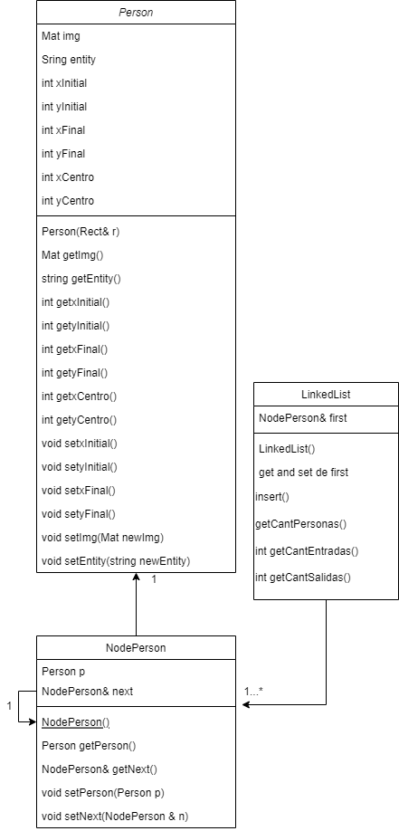

# Informe Técnico 
## Curso: Estructura de datos
### Detección y reidentificación de personas en secuencias de imágenes o video

**Alumnos:**

* Arif Bordones Sierra. (Coordinador)
* Scarlette Araya Lobos. (Encargada de bitácora)

## Resumen 

>El trabajo a realizar consiste en desarrollar una aplicación que cumpla con reconocer, enlistar y contabilizar el flujo de personas que circulan por las entradas principales de la empresa ACME. Esto se llevara a cabo por medio del uso de orientación a objeto y listas enlazadas simples. 

## 1. Introducción

La problemática propuesta consiste en crear un sistema de vigilancia para una empresa, la cual tiene como objetivo llevar la información de las personas que transitan en una una zona en específico. Para esto el equipo ideara un programa que registrara la entrada y salida de los clientes al recinto, el cual se llevara a cabo en visual studio code con c++, haciedo uso de libreria de visión artificial OpenCV.

### 1.1 Descripción del problema

El desafío de este taller consiste en la creación de un programa que sea capaz de llevar la información que nos proporcionara la camara de seguridad de la empresa, con esta información se requiere contabilizar la entrada y salida de las personas a la zona en específico.  

### 1.2 Objetivos 

**Objetivo General**

Desarrollar e implementar un programa que sea capaz de contabilizar y reconocer a las personas que transitan por las principales entradas.

**Objetivos específicos**

1. -Estructurar el problema y la creación de las clases principales.
2. -Desarrollo del código para reconocer a las personas.
3. -Mejorar el código con la inclusión de árboles como estructura principal.

### 1.3 Solución propuesta

La solución propuesta consiste en la detección de las personas ubicando el centro de esta, que en conjunto de una linea referencial(mitad de la imagen) describira la entrada o salida de las personas que transitan en el video.

*Desarrollo de la solución*

->Detección de personas
Implementar histogramas de gradientes orientados por medio del método HOGDescriptor, el cual por medio de diversos filtros de colores identifica el objeto que resalta dentro de la imagen.  

->Información personas
Por medio de lista enlazada se almacenara a las personas reconocidas por el detector.

->Cálculo
Luego de estructurar la información se calculará tráfico, cantidad y velocidad de entrada y salida de personas.  

## 2. Materiales y métodos

Para el desarrollo de este taller se requiere: 

-Video de seguridad o secuencia de imágenes.
-IDE visual studio code
-Libreria OpenCV

### 2.1 Instalación

*Librerias*
-OpenCV

*IDES*
-Visual studio code

### 2.2 Diseño 

El diseño utilizado en este taller fue la por default del Cmake, con el módulo de logic el cual contiene las clases cpp con sus propios métodos, el módulo include contiene los headers de las clases, las cules son:

->Person
->NodePerson
->linkedList
->Detector

### 2.3 Implementación

Explicar brevemente algunos aspectos de implementación: Por ejemplo, detector de caras utilizado. Se pueden realizar pequeñas reseñas al código para indicar elementos importantes en el trabajo.

## 3. Resultados obtenidos

## 4. Conclusiones

Tas estas 3 semanas de trabajo y todo lo mencionado anteriormente, se logró el 85% de las historias requeridas para esta primera entrega, aun así el objetivo principal de reconocer a las personas  por video se logró en su totalidad, con un buen uso de la libreria openCV y desempeño de parte de los programadores.
El nuevo desafío consistira en implementar árboles binarios(AVL, HEAP) para la identificación de personas. 

# Anexos

## Anexo A: Instalación librerías OpenCV

https://opencv.org/releases/

## Anexo B: Instalación de IDE y configuración librerías OpenCV

https://visualstudio.microsoft.com/es/downloads/
https://cmake.org/download/

# Referecia

##Videos:

https://www.youtube.com/watch?v=cvGEWBO0Vho
https://www.youtube.com/watch?v=mwfHopNiA3I
https://www.youtube.com/watch?v=VIg_xQ5ud8s
https://www.youtube.com/watch?v=BCJYorKIlN8

 ##Páginas
https://opencv.org/ formato apa

